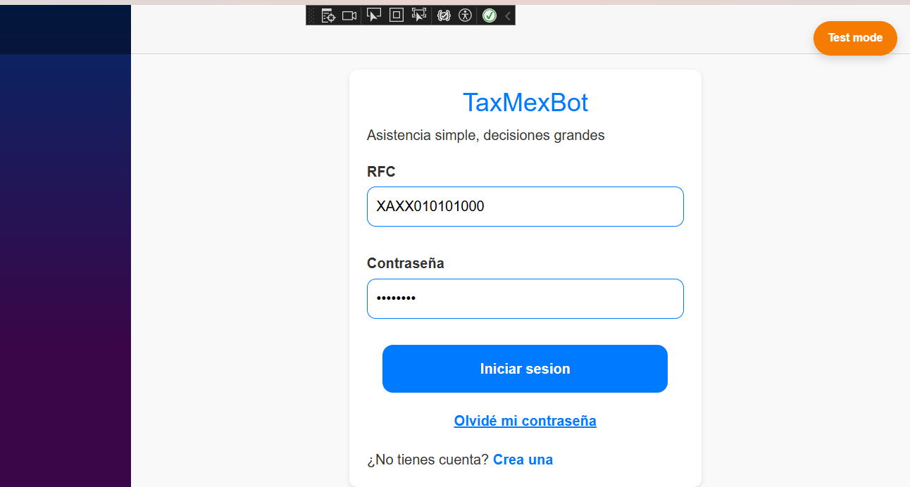
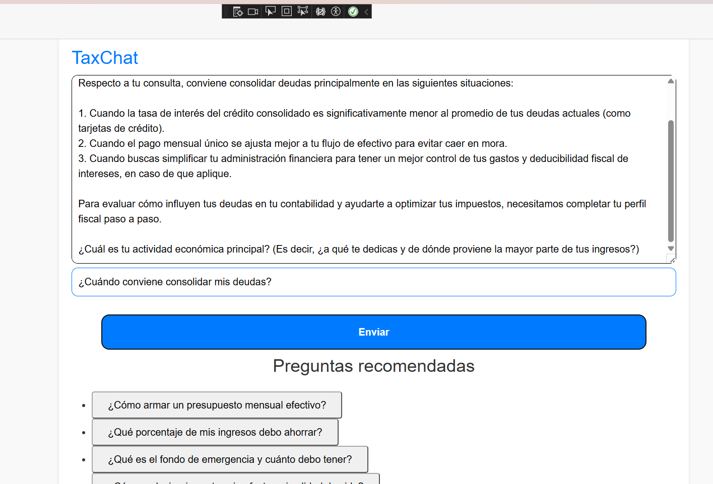

# TaxMexBOT

*"Asistencia simple, grandes decisiones"*

A cross-platform mobile assistant built with **.NET MAUI Blazor Hybrid**, developed for **HackaTecNM** (Reto: Software Inteligente / Temática: Inteligencia Artificial). TaxMexBOT helps users without accounting knowledge — freelancers, small business owners, and individuals in the informal economy — get AI-guided answers on personal finance, accounting, and Mexican tax obligations (SAT).

> **Note:** This was a hackathon team project (local stage, team DNS). The UI and in-code comments are in Spanish; this documentation is in English for accessibility.

---

## My Role

This was a collaborative effort within a 4-person team (a fourth teammate led business/market research). **I built the UI layer** — the chat interface, login/registration screens, and the wiring that connects each action to its corresponding service call, including the request that sends a user's question to Gemini. I also contributed to the team's initial brainstorming and the UI mockups that shaped the final design.

**A teammate built the persistence layer** — the `UsuarioService`, `ChatService`, and `MensajeService` classes that connect to Apache Cassandra to store users, sessions, and chat messages.

This repository contains the full team project; the sections below describe the whole system, with my specific contribution noted above.

---

## What It Does

1. A user registers or logs in using their RFC (Mexican tax ID) and password.
2. They reach a chat interface and can type a question or pick one from a list of suggested topics (savings, debt, investments, accounting, SAT filings).
3. The question is sent to **Google Gemini**, which returns a fiscal/accounting-focused response.
4. User accounts, chat sessions, and individual messages are persisted in **Apache Cassandra**.

---

## Screenshots





---

## Architecture

.NET MAUI
└── BlazorWebView
└── Razor Components
├── Login / Registro
├── MainChat
└── Injected Services
├── GeminiService: Google Gemini API (HTTP)
├── UsuarioService Cassandra: usuarios
├── ChatService Cassandra: sesiones, mensajes
├── MensajeService Cassandra: message storage
└── AppSettings used for centralized config via environment variables


Cassandra services connect directly from the mobile client. In a production version, this should move behind a dedicated backend (e.g., ASP.NET Core API) instead of connecting directly to the database and to Gemini from the client — this keeps credentials off the client and centralizes data access.

---

## Technologies Used

- **.NET MAUI** + Blazor Hybrid (Android, iOS, macOS, Windows)
- **Google Gemini API** — AI-generated responses via `GeminiService.cs`
- **Apache Cassandra** (NoSQL) via `CassandraCSharpDriver`
- **Docker** — used to run Cassandra locally during development
- Newtonsoft.Json
- BCrypt.Net-Next — installed as a dependency, not yet applied to password comparison (see Known Limitations)

---

## Requirements

- .NET 8 SDK
- Visual Studio 2022 with the **.NET Multi-platform App UI development** workload
- Cassandra (locally installed or via Docker)
- A Google Gemini API key

## Local Setup

### 1. Clone and open the project

```bash
git clone <repo-url>
cd <repo-folder>
```

Open the solution in Visual Studio.

The solution file is `prototipoGeminiready.sln`.

### 2. Set environment variables

For Windows, set these as persistent user environment variables so Visual Studio can read them:

```powershell
[Environment]::SetEnvironmentVariable("GEMINI_API_KEY", "YOUR_GEMINI_API_KEY", "User")
[Environment]::SetEnvironmentVariable("CASSANDRA_HOST", "127.0.0.1", "User")
[Environment]::SetEnvironmentVariable("CASSANDRA_PORT", "9042", "User")
[Environment]::SetEnvironmentVariable("CASSANDRA_KEYSPACE", "chatbot_fiscal", "User")
```

Close and reopen Visual Studio after setting these variables. An already-running instance does not receive newly created environment variables.

For an Android Emulator, change the Cassandra host to `10.0.2.2` before launching the app:

```powershell
[Environment]::SetEnvironmentVariable("CASSANDRA_HOST", "10.0.2.2", "User")
```

Never commit the real key to the repository or place it in `launchSettings.json`.

On Android, `127.0.0.1` refers to the device itself, not your development machine. If you return to Windows afterward, restore `CASSANDRA_HOST` to `127.0.0.1`.

### 3. Run Cassandra locally

**Docker (recommended):**
```powershell
docker run --name cassandra -p 9042:9042 -d cassandra:latest
```

If the container already exists, start it instead:

```powershell
docker start cassandra
```

Wait until Cassandra finishes starting:

```powershell
docker logs cassandra
```

**Or a local install:** ensure port 9042 is active.

Then create the schema:

```powershell
docker exec -it cassandra cqlsh
```

```sql
CREATE KEYSPACE chatbot_fiscal
WITH replication = {
  'class': 'SimpleStrategy',
  'replication_factor': 1
};

USE chatbot_fiscal;

CREATE TABLE usuarios (
    rfc TEXT PRIMARY KEY,
    email TEXT,
    password_hash TEXT
);

CREATE TABLE sesiones (
    rfc TEXT,
    sesion_id UUID,
    fecha_inicio TIMESTAMP,
    fecha_fin TIMESTAMP,
    resumen TEXT,
    PRIMARY KEY (rfc, sesion_id)
) WITH CLUSTERING ORDER BY (sesion_id DESC);

CREATE TABLE mensajes (
    sesion_id UUID,
    timestamp TIMESTAMP,
    origen TEXT,   -- 'usuario' or 'bot'
    mensaje TEXT,
    tipo TEXT,
    PRIMARY KEY (sesion_id, timestamp)
) WITH CLUSTERING ORDER BY (timestamp ASC);
```

### 4. Verify the Cassandra connection

```powershell
Test-NetConnection 127.0.0.1 -Port 9042
```

### 5. Run the app

Open `prototipoGeminiready.sln` in Visual Studio, select the `prototipoGeminiready` project, choose your target platform (Windows Machine, Android Emulator, or iOS/Mac Catalyst), and press `F5`.

---

## Known Limitations

- **Password hashing:** BCrypt.Net-Next is included as a dependency, but `UsuarioService` currently compares passwords as plain text rather than hashed values. Wiring BCrypt into the actual comparison logic is a pending fix, not yet implemented.
- **Direct client-to-database access:** the mobile app connects directly to Cassandra rather than through a backend API, which isn't recommended for production.
- **Single-node Cassandra:** the setup above runs one local Cassandra node for development/demo purposes only.

## Security Note

The repository does not contain a Gemini API key. The app expects it through the `GEMINI_API_KEY` environment variable rather than from source control. Any key that was previously exposed during development should be revoked and replaced.

## Troubleshooting

**`Cassandra.NoHostAvailableException`**
- Cassandra isn't running, or port 9042 isn't open.
- You're using `127.0.0.1` from an Android Emulator — use `10.0.2.2` instead.
- The `chatbot_fiscal` keyspace doesn't exist yet — rerun the schema setup above.

**Gemini not responding**
- Check that `$env:GEMINI_API_KEY` is set and the key is valid.

---

---

## Project Status

Functional prototype built during a 36-hour hackathon (HackaTecNM, local stage), demonstrating AI integration and distributed storage. For a production-equivalent version, the priorities would be: moving database and AI logic to a proper backend, implementing real authentication, and fixing password hashing.
